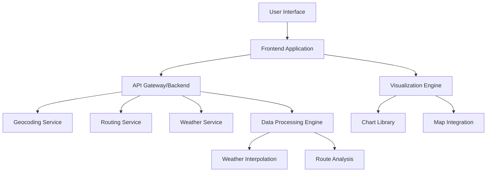

# Design Document

## Overview

The Travel Weather Plotter is a web-based application that combines route planning with weather forecasting to provide travelers with comprehensive weather insights along their journey. The system integrates with external APIs for geocoding, routing, and weather data to create an interactive visualization of weather conditions over time and distance.

The application follows a client-server architecture with a responsive web frontend that works seamlessly across desktop and mobile devices. The backend handles API integrations, data processing, and serves the frontend application.

## Architecture

### High-Level Architecture



### System Components

1. **Frontend Application**: Responsive web application handling user interactions and data visualization
2. **Backend API**: RESTful API handling external service integration and data processing
3. **External Services**: Third-party APIs for geocoding, routing, and weather data
4. **Data Processing Engine**: Core logic for route analysis and weather interpolation

## Components and Interfaces

### Frontend Components

#### User Input Component
- **Purpose**: Handles location input, travel mode selection, and timing parameters
- **Interfaces**: 
  - Location autocomplete with validation
  - Travel mode selector (driving, walking, cycling, flying, sailing, cruise)
  - Duration/speed input with smart defaults
- **Validation**: Real-time input validation with user-friendly error messages

#### Visualization Component
- **Purpose**: Renders weather data along the travel route
- **Interfaces**:
  - Interactive timeline chart showing weather progression
  - Route map with weather overlay markers
  - Weather detail panels with icons and metrics
- **Features**: 
  - Responsive design for mobile and desktop
  - Touch-friendly interactions
  - Color-coded weather indicators

#### Error Handling Component
- **Purpose**: Manages error states and user feedback
- **Interfaces**: Toast notifications, inline error messages, loading states

### Backend Components

#### API Gateway
- **Purpose**: Central entry point for all frontend requests
- **Endpoints**:
  - `POST /api/route` - Calculate route and weather
  - `GET /api/geocode` - Location validation and geocoding
  - `GET /api/health` - System health check

#### Route Service
- **Purpose**: Handles route calculation for different travel modes
- **Interfaces**:
  - Integration with mapping services (Google Maps, OpenStreetMap)
  - Route optimization based on travel mode
  - Waypoint generation for weather sampling

#### Weather Service
- **Purpose**: Retrieves and processes weather forecast data
- **Interfaces**:
  - Integration with weather APIs (OpenWeatherMap, WeatherAPI)
  - Multi-point weather data retrieval
  - Weather data normalization and formatting

#### Data Processing Service
- **Purpose**: Core business logic for combining route and weather data
- **Functions**:
  - Route segmentation based on travel speed and duration
  - Weather interpolation between forecast points
  - Timeline calculation and synchronization

## Data Models

### Route Model
```typescript
interface Route {
  id: string;
  source: Location;
  destination: Location;
  travelMode: TravelMode;
  waypoints: Waypoint[];
  totalDistance: number;
  estimatedDuration: number;
  segments: RouteSegment[];
}

interface Location {
  name: string;
  coordinates: {
    latitude: number;
    longitude: number;
  };
  address?: string;
}

interface Waypoint {
  coordinates: {
    latitude: number;
    longitude: number;
  };
  distanceFromStart: number;
  estimatedTimeFromStart: number;
}
```

### Weather Model
```typescript
interface WeatherForecast {
  location: Location;
  timestamp: Date;
  temperature: {
    current: number;
    feelsLike: number;
    min: number;
    max: number;
  };
  conditions: {
    main: WeatherCondition;
    description: string;
    icon: string;
  };
  precipitation: {
    type: PrecipitationType;
    probability: number;
    intensity: number;
  };
  wind: {
    speed: number;
    direction: number;
  };
  humidity: number;
  visibility: number;
}

enum WeatherCondition {
  SUNNY = 'sunny',
  CLOUDY = 'cloudy',
  OVERCAST = 'overcast',
  RAINY = 'rainy',
  STORMY = 'stormy',
  FOGGY = 'foggy',
  SNOWY = 'snowy'
}

enum PrecipitationType {
  NONE = 'none',
  RAIN = 'rain',
  SLEET = 'sleet',
  SNOW = 'snow',
  HAIL = 'hail'
}
```

### Travel Configuration Model
```typescript
interface TravelConfig {
  mode: TravelMode;
  customDuration?: number;
  customSpeed?: number;
  preferences: {
    weatherUpdateInterval: number;
    routeOptimization: boolean;
  };
}

enum TravelMode {
  DRIVING = 'driving',
  WALKING = 'walking',
  CYCLING = 'cycling',
  FLYING = 'flying',
  SAILING = 'sailing',
  CRUISE = 'cruise'
}
```

## Error Handling

### Error Categories
1. **Input Validation Errors**: Invalid locations, unrealistic travel parameters
2. **External API Errors**: Service unavailability, rate limiting, invalid responses
3. **Network Errors**: Connectivity issues, timeouts
4. **Data Processing Errors**: Route calculation failures, weather interpolation issues

### Error Handling Strategy
- **Graceful Degradation**: Show partial results when some data is unavailable
- **Retry Logic**: Automatic retry for transient failures with exponential backoff
- **User Feedback**: Clear, actionable error messages with suggested solutions
- **Fallback Options**: Alternative data sources or simplified functionality when primary services fail

### Error Response Format
```typescript
interface ErrorResponse {
  error: {
    code: string;
    message: string;
    details?: any;
    suggestions?: string[];
  };
  timestamp: Date;
  requestId: string;
}
```

## Testing Strategy

### Unit Testing
- **Frontend**: Component testing with Jest and React Testing Library
- **Backend**: Service and utility function testing with Jest
- **Coverage Target**: 80% code coverage minimum

### Integration Testing
- **API Integration**: Test external service integrations with mock responses
- **End-to-End Workflows**: Test complete user journeys from input to visualization
- **Cross-browser Testing**: Ensure compatibility across major browsers and mobile devices

### Performance Testing
- **Load Testing**: API performance under concurrent user load
- **Mobile Performance**: Rendering performance on mobile devices
- **Network Resilience**: Behavior under poor network conditions

### Test Data Strategy
- **Mock Weather Data**: Comprehensive test datasets covering various weather conditions
- **Route Test Cases**: Predefined routes for different travel modes and distances
- **Edge Cases**: Invalid inputs, extreme weather conditions, very long/short routes

## Technical Considerations

### Mobile Optimization
- **Responsive Design**: CSS Grid and Flexbox for adaptive layouts
- **Touch Interactions**: Optimized touch targets and gesture support
- **Performance**: Lazy loading, image optimization, and efficient rendering
- **Offline Capability**: Service worker for basic functionality without network

### API Integration Strategy
- **Rate Limiting**: Implement client-side rate limiting and request queuing
- **Caching**: Cache geocoding results and weather data with appropriate TTL
- **API Key Management**: Secure storage and rotation of API credentials
- **Service Selection**: Primary and fallback providers for critical services

### Data Processing Optimization
- **Route Segmentation**: Intelligent waypoint selection based on route complexity
- **Weather Interpolation**: Spatial and temporal interpolation for smooth weather transitions
- **Parallel Processing**: Concurrent API calls where possible to reduce latency

### Security Considerations
- **Input Sanitization**: Validate and sanitize all user inputs
- **API Security**: Secure API key storage and usage
- **HTTPS**: Enforce secure connections for all communications
- **CORS**: Proper cross-origin resource sharing configuration