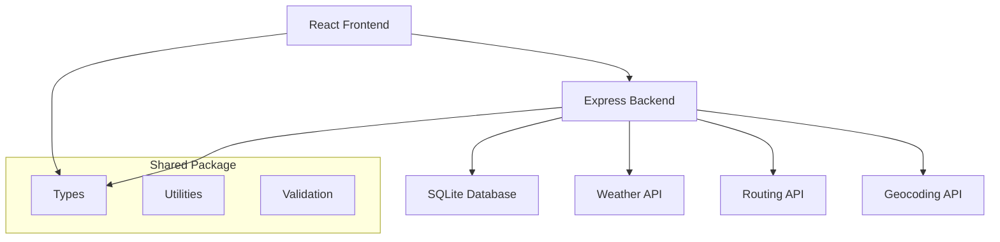

# 🌦️ Travel Weather Plotter

<div align="center">

[](https://github.com/philcali/travel-weather-plotter/actions)
[](https://github.com/philcali/travel-weather-plotter/actions)
[](https://www.typescriptlang.org/)
[](https://opensource.org/licenses/MIT)

*A comprehensive travel planning application that combines intelligent route planning with real-time weather forecasting to help travelers make informed decisions about their journeys.*

[Features](#-features) • [Quick Start](#-quick-start) • [Docker Setup](#-docker-setup) • [Documentation](#-documentation) • [API](#-api-reference) • [Contributing](#-contributing)

</div>

## 🚀 Features

### 🗺️ **Intelligent Route Planning**
- **Multi-modal Travel**: Support for driving, walking, cycling, flying, sailing, and cruise travel
- **Weather-aware Routing**: Route suggestions that consider current and forecasted weather conditions
- **Real-time Traffic**: Integration with traffic data for optimal route calculation
- **Waypoint Management**: Add custom stops and points of interest along your route

### 🌤️ **Advanced Weather Integration**
- **Real-time Weather**: Current conditions for any location worldwide
- **5-day Forecasts**: Detailed weather predictions along your entire route
- **Weather Alerts**: Notifications for severe weather conditions
- **Historical Data**: Access to past weather patterns for planning

### 📖 **Journey Journaling**
- **Trip Documentation**: Record and organize your travel experiences
- **Photo Integration**: Attach images to your journey entries
- **Weather Logging**: Automatic weather condition recording
- **Export Options**: Export your journeys in multiple formats

### 🔧 **Developer Features**
- **RESTful API**: Comprehensive API for all functionality
- **Real-time Updates**: WebSocket support for live data
- **Caching System**: Intelligent caching for improved performance
- **Rate Limiting**: Built-in API rate limiting and throttling

## 🏗️ Architecture



## 🛠️ Tech Stack

### Frontend
- **React 18** with TypeScript
- **Vite** for fast development and building
- **React Router** for navigation
- **Tailwind CSS** for styling
- **React Query** for data fetching

### Backend
- **Node.js 18+** with Express
- **TypeScript** for type safety
- **SQLite** with better-sqlite3
- **JWT** authentication
- **Vitest** for testing

### DevOps & CI/CD
- **GitHub Actions** for automated testing and deployment
- **Docker** support for containerization
- **ESLint & Prettier** for code quality
- **Husky** for git hooks

## 🚀 Quick Start

### Prerequisites

- **Node.js** 18.0 or higher
- **npm** 8.0 or higher
- API keys for external services (see [Configuration](#configuration))

### Installation

1. **Clone the repository**
   ```bash
   git clone https://github.com/philcali/travel-weather-plotter.git
   cd travel-weather-plotter
   ```

2. **Install dependencies**
   ```bash
   npm install
   npm run install:all
   ```

3. **Set up environment variables**
   ```bash
   cp .env.example .env
   ```
   
   Edit `.env` with your configuration:
   ```env
   # Weather API
   WEATHER_API_KEY=your_openweathermap_api_key
   
   # Routing API
   ROUTING_API_KEY=your_routing_api_key
   
   # Database
   DATABASE_URL=./data/travel_weather.db
   
   # JWT Secret
   JWT_SECRET=your_super_secret_jwt_key
   
   # Server Configuration
   PORT=3001
   FRONTEND_URL=http://localhost:5173
   ```

4. **Initialize the database**
   ```bash
   npm run db:migrate
   ```

5. **Start the development servers**
   ```bash
   npm run dev
   ```

   This will start:
   - Frontend: http://localhost:5173
   - Backend API: http://localhost:3001
   - API Documentation: http://localhost:3001/api/docs

## 🐳 Docker Setup

### Quick Start with Docker

**Production:**
```bash
npm run docker:start:prod
```

**Development with hot reload:**
```bash
npm run docker:start:dev
```

### Manual Docker Commands

```bash
# Build and run production
docker build -t travel-weather-plotter .
docker run -p 3001:3001 -e WEATHER_API_KEY=your_key travel-weather-plotter

# Or use Docker Compose
docker-compose up -d
```

### Docker Scripts

| Command | Purpose |
|---------|---------|
| `npm run docker:start` | Start production environment |
| `npm run docker:start:dev` | Start development environment |
| `npm run docker:stop` | Stop all containers |
| `npm run docker:logs` | View container logs |
| `npm run docker:backup` | Backup application data |

📖 **For comprehensive Docker setup instructions, see [DOCKER.md](DOCKER.md)**

## 📁 Project Structure

```
travel-weather-plotter/
├── 📁 frontend/                 # React frontend application
│   ├── 📁 src/
│   │   ├── 📁 components/       # Reusable UI components
│   │   ├── 📁 pages/           # Page components
│   │   ├── 📁 hooks/           # Custom React hooks
│   │   ├── 📁 services/        # API service functions
│   │   └── 📁 utils/           # Frontend utilities
│   ├── 📄 package.json
│   └── 📄 vite.config.ts
├── 📁 backend/                  # Express backend API
│   ├── 📁 src/
│   │   ├── 📁 routes/          # API route handlers
│   │   ├── 📁 services/        # Business logic services
│   │   ├── 📁 models/          # Data models
│   │   ├── 📁 middleware/      # Express middleware
│   │   ├── 📁 database/        # Database configuration
│   │   └── 📁 __tests__/       # Test files
│   ├── 📄 package.json
│   └── 📄 tsconfig.json
├── 📁 shared/                   # Shared types and utilities
│   ├── 📁 src/
│   │   ├── 📁 types/           # TypeScript type definitions
│   │   └── 📁 utils/           # Shared utility functions
│   └── 📄 package.json
├── 📁 docker-scripts/           # Docker management scripts
├── 📁 .github/                  # GitHub Actions workflows
│   └── 📁 workflows/
├── 📄 package.json              # Root package.json
├── 📄 README.md                 # This file
├── 📄 DOCKER.md                 # Docker setup guide
└── 📄 .env.example              # Environment variables template
```

## 🔧 Configuration

### API Keys Required

1. **OpenWeatherMap API** (Free tier available)
   - Sign up at [openweathermap.org](https://openweathermap.org/api)
   - Add `WEATHER_API_KEY` to your `.env` file

2. **Routing Service** (Optional - falls back to mock data)
   - Choose from supported providers
   - Add `ROUTING_API_KEY` to your `.env` file

3. **Geocoding Service** (Optional - falls back to mock data)
   - Add `GEOCODING_API_KEY` to your `.env` file

### Environment Variables

| Variable | Description | Default | Required |
|----------|-------------|---------|----------|
| `WEATHER_API_KEY` | OpenWeatherMap API key | - | No* |
| `ROUTING_API_KEY` | Routing service API key | - | No* |
| `GEOCODING_API_KEY` | Geocoding service API key | - | No* |
| `JWT_SECRET` | Secret for JWT token signing | Generated | No |
| `PORT` | Backend server port | 3001 | No |
| `DATABASE_URL` | SQLite database file path | `./data/travel_weather.db` | No |
| `FRONTEND_URL` | Frontend URL for CORS | `http://localhost:5173` | No |

*\\* The application will use mock data if API keys are not provided*

## 🧪 Development

### Available Scripts

| Command | Description |
|---------|-------------|
| `npm run dev` | Start all development servers |
| `npm run build` | Build all packages for production |
| `npm run test` | Run all test suites |
| `npm run test:watch` | Run tests in watch mode |
| `npm run lint` | Lint all packages |
| `npm run lint:fix` | Fix linting issues |
| `npm run type-check` | Run TypeScript type checking |
| `npm run db:migrate` | Run database migrations |
| `npm run db:seed` | Seed database with sample data |

### Testing

The project uses **Vitest** for testing with comprehensive coverage:

```bash
# Run all tests
npm run test

# Run tests for specific package
npm run test:backend
npm run test:frontend
npm run test:shared

# Run tests with coverage
npm run test:coverage

# Run tests in watch mode
npm run test:watch
```

### Code Quality

- **ESLint** for code linting
- **Prettier** for code formatting
- **TypeScript** for type safety
- **Husky** for pre-commit hooks

```bash
# Check code quality
npm run lint
npm run type-check

# Fix issues automatically
npm run lint:fix
npm run format
```

## 📚 API Reference

### Authentication

The API uses JWT tokens for authentication:

```bash
# Register a new user
POST /api/auth/register
{
  "email": "user@example.com",
  "password": "securepassword",
  "displayName": "John Doe"
}

# Login
POST /api/auth/login
{
  "email": "user@example.com",
  "password": "securepassword"
}
```

### Weather Endpoints

```bash
# Get current weather
GET /api/weather/current?lat=40.7128&lon=-74.0060

# Get weather forecast
GET /api/weather/forecast?lat=40.7128&lon=-74.0060&timestamp=2024-01-15T12:00:00Z

# Get route weather
POST /api/weather/route
{
  "locations": [
    { "latitude": 40.7128, "longitude": -74.0060 },
    { "latitude": 42.3601, "longitude": -71.0589 }
  ]
}
```

### Routing Endpoints

```bash
# Calculate route
POST /api/route/calculate
{
  "source": { "latitude": 40.7128, "longitude": -74.0060 },
  "destination": { "latitude": 42.3601, "longitude": -71.0589 },
  "travelMode": "driving"
}
```

### Journal Endpoints

```bash
# Create journey entry
POST /api/journal
{
  "name": "Trip to Boston",
  "description": "Weekend getaway",
  "route": { /* route object */ },
  "startDate": "2024-01-15T09:00:00Z"
}

# Get user journeys
GET /api/journal?limit=10&offset=0
```

For complete API documentation, visit `/api/docs` when running the development server.

## 🚀 Deployment

### Using Docker (Recommended)

**Quick Start:**
```bash
# Production
npm run docker:start:prod

# Development with hot reload
npm run docker:start:dev
```

**Manual Docker Commands:**
```bash
# Build and run production
docker build -t travel-weather-plotter .
docker run -p 3001:3001 -e WEATHER_API_KEY=your_key travel-weather-plotter

# Or use Docker Compose
docker-compose up -d
```

📖 **For comprehensive Docker setup instructions, see [DOCKER.md](DOCKER.md)**

### Manual Deployment

1. **Build the application**
   ```bash
   npm run build
   ```

2. **Set production environment variables**
   ```bash
   export NODE_ENV=production
   export PORT=3001
   export WEATHER_API_KEY=your_production_key
   ```

3. **Start the server**
   ```bash
   npm start
   ```

### GitHub Actions

The project includes comprehensive CI/CD workflows:

- **Continuous Integration**: Automated testing on all PRs
- **Security Scanning**: Regular dependency and security audits
- **Deployment**: Automated deployment on main branch updates

## 🤝 Contributing

We welcome contributions! Please see our [Contributing Guide](CONTRIBUTING.md) for details.

### Development Workflow

1. **Fork the repository**
2. **Create a feature branch**
   ```bash
   git checkout -b feature/amazing-feature
   ```
3. **Make your changes**
4. **Add tests for new functionality**
5. **Ensure all tests pass**
   ```bash
   npm run test
   npm run lint
   ```
6. **Commit your changes**
   ```bash
   git commit -m 'Add amazing feature'
   ```
7. **Push to your branch**
   ```bash
   git push origin feature/amazing-feature
   ```
8. **Open a Pull Request**

### Code Style

- Follow the existing code style
- Use TypeScript for all new code
- Add JSDoc comments for public APIs
- Write tests for new functionality
- Update documentation as needed

## 📄 License

This project is licensed under the MIT License - see the [LICENSE](LICENSE) file for details.

## 🙏 Acknowledgments

- [OpenWeatherMap](https://openweathermap.org/) for weather data
- [React](https://reactjs.org/) team for the amazing framework
- [Express](https://expressjs.com/) for the robust backend framework
- All contributors who help improve this project

## 📞 Support

- 📧 **Email**: support@travelweatherplotter.com
- 🐛 **Issues**: [GitHub Issues](https://github.com/philcali/travel-weather-plotter/issues)
- 💬 **Discussions**: [GitHub Discussions](https://github.com/philcali/travel-weather-plotter/discussions)
- 📖 **Documentation**: [Wiki](https://github.com/philcali/travel-weather-plotter/wiki)

---

<div align="center">

**Made with ❤️ by the Travel Weather Plotter Team**

[⭐ Star this repo](https://github.com/philcali/travel-weather-plotter) • [🐛 Report Bug](https://github.com/philcali/travel-weather-plotter/issues) • [✨ Request Feature](https://github.com/philcali/travel-weather-plotter/issues)

</div>